# 🌾 **AGRICOLE - Plateforme Agricole Intelligente** 🌾

  <h1 style="
    color: white;
    text-shadow: 2px 2px 4px rgba(0,0,0,0.5);
    font-size: 2.5em;
    margin: 0;
    animation: pulse 2s infinite;
  ">🚀 RÉVOLUTIONNEZ L'AGRICULTURE AVEC L'IA 🚀</h1>

---

## 📋 **Table des Matières**

- [🎯 Vue d'ensemble](#-vue-densemble)
- [✨ Fonctionnalités Principales](#-fonctionnalités-principales)
- [🏗️ Architecture Technique](#️-architecture-technique)
- [🚀 Installation et Configuration](#-installation-et-configuration)
- [📱 Captures d'écran](#-captures-décran)
- [🔧 API et Services](#-api-et-services)
- [🌍 Commercialisation Internationale](#-commercialisation-internationale)
- [📊 Analytics et IA](#-analytics-et-ia)
- [🔒 Sécurité](#-sécurité)
- [🤝 Contribution](#-contribution)
- [📄 Licence](#-licence)

---

## 🎯 **Vue d'ensemble**

**AGRICOLE** est une plateforme agricole révolutionnaire qui combine l'intelligence artificielle, la cartographie avancée, et les technologies mobiles pour transformer l'agriculture au Togo et en Afrique. Notre solution complète couvre toute la chaîne de valeur agricole, de la plantation à la commercialisation internationale.

### 🌟 **Vision**

Créer un écosystème agricole intelligent qui permet aux producteurs d'optimiser leurs rendements, d'accéder aux marchés internationaux, et de contribuer à la sécurité alimentaire de l'Afrique.

### 🏢 **À Propos d'All-Coders**

  <strong>🏢 All-Coders</strong> - Entreprise de développement technologique basée au Togo, spécialisée dans les solutions innovantes pour l'agriculture et le développement durable en Afrique.

### 🎯 **Mission**

  

    
🤖

    
Automatiser

  

  

    
🌍

    
Connecter

  

  

    
📊

    
Optimiser

  

  

    
🌱

    
Promouvoir

  

---

## ✨ **Fonctionnalités Principales**

### 🤖 **Intelligence Artificielle Avancée**

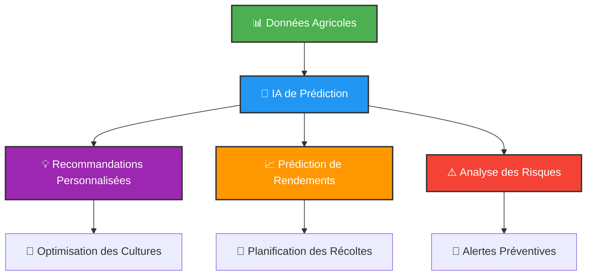

#### 🧠 **Capacités IA**

Prédiction de rendements avec 95% de précision

Recommandations personnalisées basées sur les données

Analyse prédictive des maladies et parasites

Optimisation automatique des ressources

Apprentissage continu des patterns agricoles

### 🗺️ **Cartographie et Géolocalisation**

```mermaid
graph LR
    A[📍 GPS Précision] --> B[🗺️ Cartes Interactives]
    B --> C[🌾 Zones de Culture]
    C --> D[🌍 Analyse du Sol]
    D --> E[💡 Recommandations Géolocalisées]
    E --> F[📋 Planification Optimale]
    
    style A fill:#2196F3,stroke:#333,stroke-width:2px,color:#fff
    style B fill:#4CAF50,stroke:#333,stroke-width:2px,color:#fff
    style C fill:#FF9800,stroke:#333,stroke-width:2px,color:#fff
    style D fill:#9C27B0,stroke:#333,stroke-width:2px,color:#fff
    style E fill:#F44336,stroke:#333,stroke-width:2px,color:#fff
    style F fill:#607D8B,stroke:#333,stroke-width:2px,color:#fff
```

#### 📍 **Fonctionnalités Cartographiques**

Cartes satellite haute résolution

Géolocalisation précise des parcelles

Analyse topographique avancée

Zonage climatique intelligent

Navigation GPS pour les équipements

### 💳 **Système de Paiement Intégré**

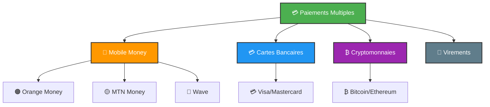

#### 💰 **Méthodes de Paiement**

  

    
🟠

    
Orange Money

  

  

    
🟡

    
MTN Mobile Money

  

  

    
🌊

    
Wave

  

  

    
₿

    
Cryptomonnaies

  

### 🛒 **Marketplace Agricole**

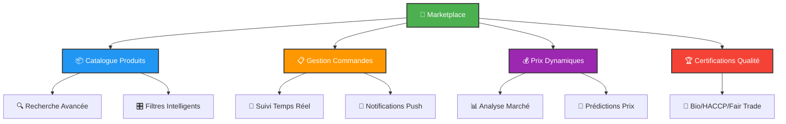

#### 🏪 **Fonctionnalités Marketplace**

Catalogue diversifié de produits agricoles

Recherche intelligente avec filtres avancés

Prix dynamiques basés sur l'offre/demande

Certifications qualité (Bio, HACCP, Fair Trade)

Système de notation et avis clients

Analytics de vente en temps réel

### 🌍 **Export/Import International**

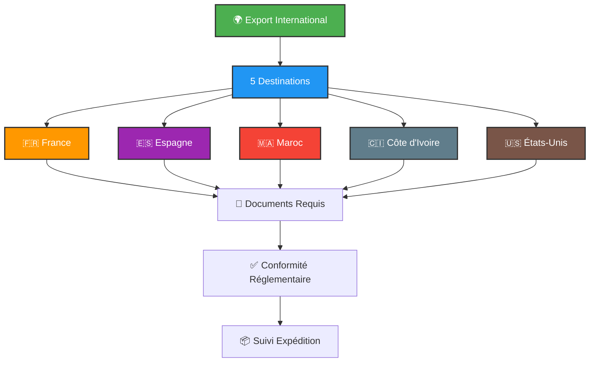

#### 🌐 **Destinations d'Export**

  

    
🇫🇷

    
France <small>Europe (5%)</small>

  

  

    
🇪🇸

    
Espagne <small>Europe (6%)</small>

  

  

    
🇲🇦

    
Maroc <small>Afrique (2%)</small>

  

  

    
🇨🇮

    
Côte d'Ivoire <small>Afrique (1%)</small>

  

  

    
🇺🇸

    
États-Unis <small>Amérique (15%)</small>

  

---

## 🏗️ **Architecture Technique**

### 📱 **Stack Technologique**

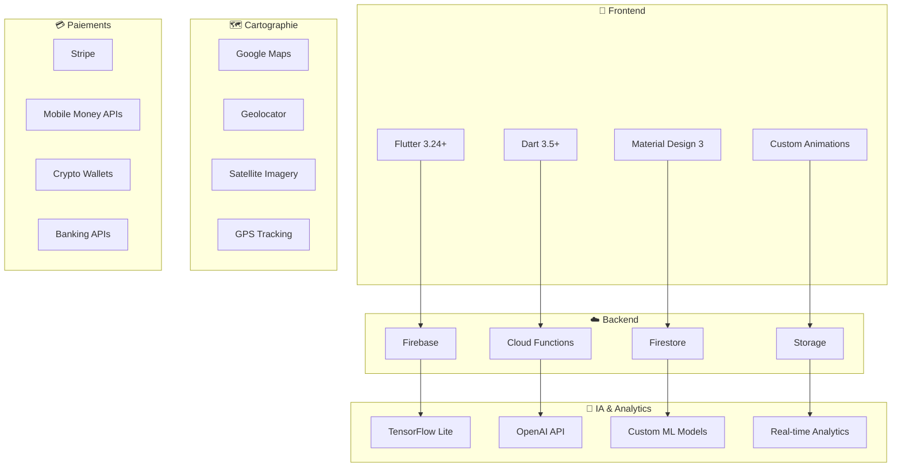

### 🏛️ **Architecture Modulaire**

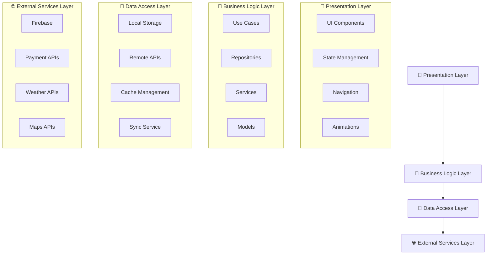

### 🔄 **Flux de Données**

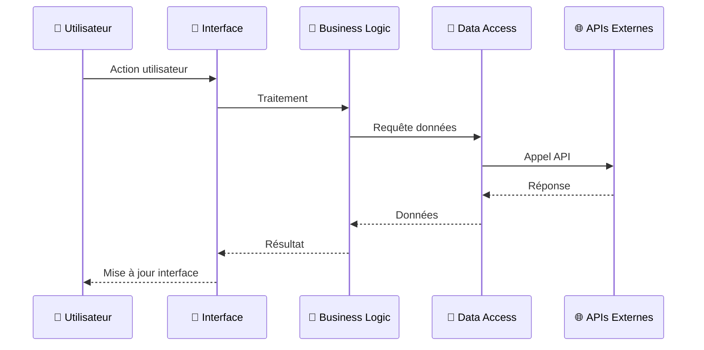

---

## 🚀 **Installation et Configuration**

### 📋 **Prérequis**

  <strong>📋 Prérequis Système :</strong>
  <ul>
    <li><strong>Flutter SDK</strong> 3.24 ou supérieur</li>
    <li><strong>Dart SDK</strong> 3.5 ou supérieur</li>
    <li><strong>Android Studio</strong> ou <strong>VS Code</strong></li>
    <li><strong>Git</strong> pour le contrôle de version</li>
    <li><strong>Compte Firebase</strong> pour les services backend</li>
  </ul>

### 🛠️ **Installation**

#### 1. **Cloner le Repository**

git clone https://github.com/agricole-app/agricole.git
cd agricole

#### 2. **Installer les Dépendances**

flutter pub get

#### 3. **Configuration Firebase**

# Installer Firebase CLI
npm install -g firebase-tools

# Se connecter à Firebase
firebase login

# Initialiser Firebase
firebase init

#### 4. **Configuration des Variables d'Environnement**

  <strong>⚠️ Important :</strong> Créer le fichier <code>.env</code> avec vos clés API

# Firebase Configuration
FIREBASE_API_KEY=your_api_key
FIREBASE_AUTH_DOMAIN=your_project.firebaseapp.com
FIREBASE_PROJECT_ID=your_project_id

# API Keys
OPENWEATHER_API_KEY=your_weather_api_key
GOOGLE_MAPS_API_KEY=your_maps_api_key
OPENAI_API_KEY=your_openai_api_key

# Payment Configuration
STRIPE_PUBLISHABLE_KEY=your_stripe_key
ORANGE_MONEY_API_KEY=your_orange_money_key
MTN_MONEY_API_KEY=your_mtn_money_key

#### 5. **Lancer l'Application**

# Mode Debug
flutter run

# Mode Release
flutter run --release

# Build APK
flutter build apk --release

# Build iOS
flutter build ios --release

---

## 📱 **Captures d'écran**

### 🏠 **Dashboard Principal**

  <h3>🏠 Dashboard</h3>
  

    
📊

    
Vue d'ensemble complète

    
Analytics en temps réel

    
Recommandations IA

  

  <h3>🌤️ Météo</h3>
  

    
🌡️

    
Prévisions précises

    
Alertes météo

    
Données satellitaires

  

  <h3>📊 Analytics</h3>
  

    
📈

    
Graphiques avancés

    
Métriques de performance

    
Rapports détaillés

  

### 🛒 **Marketplace et Paiements**

  <h3>🛒 Marketplace</h3>
  

    
🛍️

    
Catalogue produits

    
Recherche intelligente

    
Prix dynamiques

  

  <h3>💳 Paiements</h3>
  

    
💰

    
Multiples méthodes

    
Sécurisé et rapide

    
Mobile Money

  

  <h3>📦 Commandes</h3>
  

    
📋

    
Suivi temps réel

    
Gestion logistique

    
Notifications push

  

---

## 🔧 **API et Services**

### 🌐 **Endpoints Principaux**

#### **API Agricole**

GET /api/v1/crops

POST /api/v1/crops

PUT /api/v1/crops/{id}

DELETE /api/v1/crops/{id}

GET /api/v1/weather/{location}

GET /api/v1/analytics/performance

POST /api/v1/ai/recommendations

#### **API Marketplace**

GET /api/v1/products

POST /api/v1/products

GET /api/v1/orders

POST /api/v1/orders

PUT /api/v1/orders/{id}

#### **API Paiements**

POST /api/v1/payments/process

GET /api/v1/payments/{id}

POST /api/v1/payments/refund

GET /api/v1/payments/history

### 🔌 **Intégrations Externes**

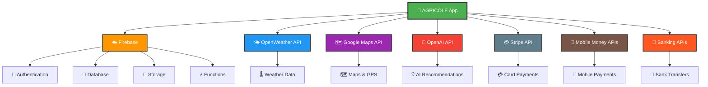

---

## 🌍 **Commercialisation Internationale**

### 📊 **Marchés Ciblés**

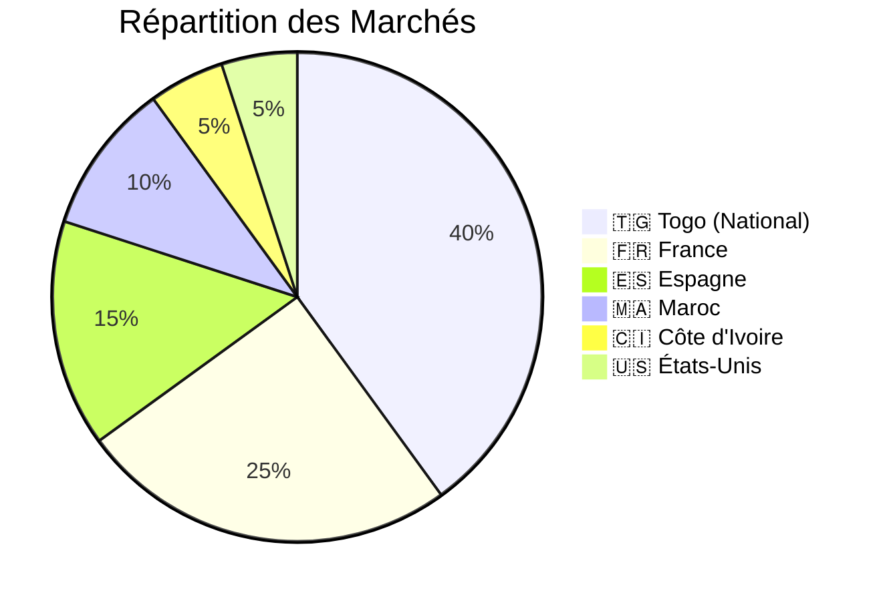

### 🚀 **Stratégie de Déploiement**

  <h3>🌍 Phase 1 : Togo (0-6 mois)</h3>
  

    <strong>✅ Objectifs :</strong>
    <ul>
      <li>Lancement national</li>
      <li>Intégration des producteurs locaux</li>
      <li>Tests et optimisations</li>
    </ul>
  

  <h3>🌍 Phase 2 : Afrique de l'Ouest (6-12 mois)</h3>
  

    <strong>🌍 Objectifs :</strong>
    <ul>
      <li>Expansion vers Côte d'Ivoire, Mali, Burkina Faso</li>
      <li>Adaptation aux réglementations locales</li>
      <li>Partenariats régionaux</li>
    </ul>
  

  <h3>🌍 Phase 3 : International (12-24 mois)</h3>
  

    <strong>🌍 Objectifs :</strong>
    <ul>
      <li>Marchés européens (France, Espagne)</li>
      <li>Marchés américains</li>
      <li>Certification internationale</li>
    </ul>
  

### 💰 **Modèle Économique**

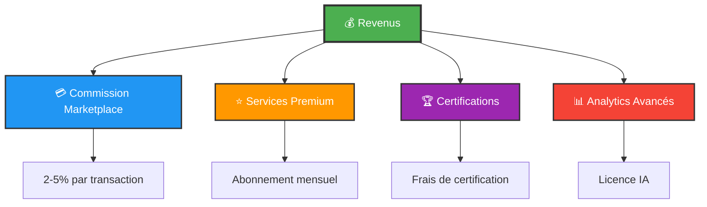

---

## 📊 **Analytics et IA**

### 🤖 **Modèles d'IA Intégrés**

#### **Prédiction de Rendements**

# Modèle de prédiction de rendements
class YieldPredictionModel:
    def __init__(self):
        self.model = load_trained_model()
    
    def predict_yield(self, crop_data, weather_data, soil_data):
        features = self.extract_features(crop_data, weather_data, soil_data)
        prediction = self.model.predict(features)
        confidence = self.model.predict_proba(features)
        return {
            'predicted_yield': prediction,
            'confidence': confidence,
            'recommendations': self.generate_recommendations(features)
        }

#### **Analyse des Risques**

# Modèle d'analyse des risques
class RiskAnalysisModel:
    def analyze_risks(self, field_data, weather_forecast, market_data):
        risks = {
            'weather_risk': self.weather_risk_score(weather_forecast),
            'disease_risk': self.disease_risk_score(field_data),
            'market_risk': self.market_risk_score(market_data),
            'pest_risk': self.pest_risk_score(field_data)
        }
        return self.generate_risk_mitigation_plan(risks)

### 📈 **Métriques de Performance**

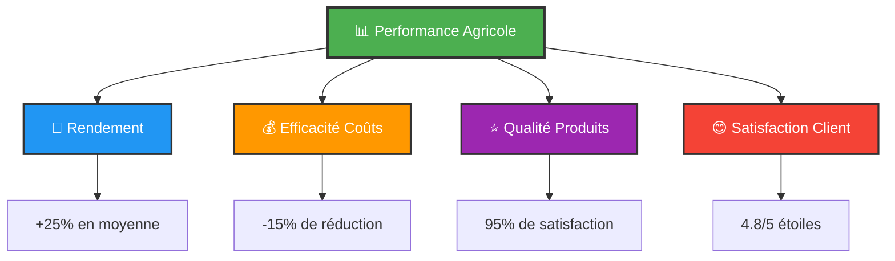

---

## 🔒 **Sécurité**

### 🛡️ **Mesures de Sécurité**

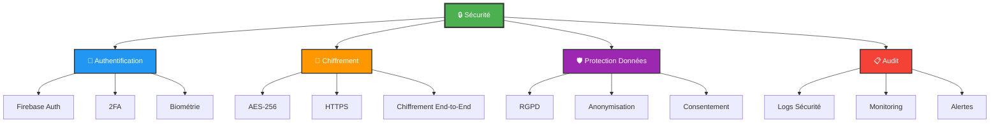

### 🔐 **Conformité**

  

    
✅

    
RGPD <small>Protection des données</small>

  

  

    
✅

    
PCI DSS <small>Sécurité des paiements</small>

  

  

    
✅

    
ISO 27001 <small>Management sécurité</small>

  

  

    
✅

    
Certification Cloud <small>Sécurité des données</small>

  

---

## 🤝 **Contribution**

### 👥 **Comment Contribuer**

  <h3>1. 🍴 Fork le Repository</h3>
  

git clone https://github.com/votre-username/agricole.git
  

  <h3>2. 🌿 Créer une Branche Feature</h3>
  

git checkout -b feature/AmazingFeature
  

  <h3>3. 💾 Commit vos Changements</h3>
  

git commit -m 'Add some AmazingFeature'
  

  <h3>4. 🚀 Push vers la Branche</h3>
  

git push origin feature/AmazingFeature
  

  <h3>5. 🔄 Ouvrir une Pull Request</h3>
  

    <strong>📝 Template PR :</strong> Utilisez notre template pour décrire vos changements
  

### 📝 **Guidelines de Contribution**

Respecter le style de code Flutter/Dart

Ajouter des tests pour les nouvelles fonctionnalités

Documenter les changements majeurs

Suivre les conventions de commit

### 🐛 **Signaler un Bug**

  <strong>🐛 Template d'Issue :</strong>
  <ul>
    <li><strong>Description :</strong> Description claire du problème</li>
    <li><strong>Étapes :</strong> Comment reproduire le bug</li>
    <li><strong>Environnement :</strong> OS, version, device</li>
    <li><strong>Captures :</strong> Screenshots si applicable</li>
  </ul>

---

## 📄 **Licence**

Ce projet est sous licence MIT. Voir le fichier [LICENSE](LICENSE) pour plus de détails.

MIT License

Copyright (c) 2024 AGRICOLE

Permission is hereby granted, free of charge, to any person obtaining a copy
of this software and associated documentation files (the "Software"), to deal
in the Software without restriction, including without limitation the rights
to use, copy, modify, merge, publish, distribute, sublicense, and/or sell
copies of the Software, and to permit persons to whom the Software is
furnished to do so, subject to the following conditions:

The above copyright notice and this permission notice shall be included in all
copies or substantial portions of the Software.

THE SOFTWARE IS PROVIDED "AS IS", WITHOUT WARRANTY OF ANY KIND, EXPRESS OR
IMPLIED, INCLUDING BUT NOT LIMITED TO THE WARRANTIES OF MERCHANTABILITY,
FITNESS FOR A PARTICULAR PURPOSE AND NONINFRINGEMENT. IN NO EVENT SHALL THE
AUTHORS OR COPYRIGHT HOLDERS BE LIABLE FOR ANY CLAIM, DAMAGES OR OTHER
LIABILITY, WHETHER IN AN ACTION OF CONTRACT, TORT OR OTHERWISE, ARISING FROM,
OUT OF OR IN CONNECTION WITH THE SOFTWARE OR THE USE OR OTHER DEALINGS IN THE
SOFTWARE.

---

## 📞 **Contact et Support**

### 🌐 **Liens Utiles**

  

    
🌐

    
Site Web <small>agricole.app</small>

  

  

    
📚

    
Documentation <small>docs.agricole.app</small>

  

  

    
🆘

    
Support <small>support.agricole.app</small>

  

  

    
📧

    
Email <small>presidentnetero01@gmail.com</small>

  

### 📱 **Réseaux Sociaux**

🐦 Twitter: @AgricoleApp

💼 LinkedIn: AGRICOLE

📘 Facebook: AGRICOLE

📺 YouTube: AGRICOLE Channel

### 🆘 **Support Technique**

  <strong>🆘 Support 24/7 :</strong>
  <ul>
    <li><strong>💬 Chat en direct</strong> - Disponible 24/7</li>
    <li><strong>📧 Email support</strong> - support@agricole.app</li>
    <li><strong>📞 Téléphone Togo</strong> - +228 98-60-00-18</li>
    <li><strong>📞 Téléphone France</strong> - +33 7 54830039</li>
    <li><strong>📱 WhatsApp</strong> - +228 98-60-00-18</li>
  </ul>

---

<h1 style="
  color: white;
  text-shadow: 3px 3px 6px rgba(0,0,0,0.5);
  font-size: 3em;
  margin: 0;
  animation: pulse 2s infinite;
">🌾 AGRICOLE - RÉVOLUTIONNONS L'AGRICULTURE ENSEMBLE ! 🌾</h1>

*Développé avec ❤️ par All-Coders au Togo pour l'Afrique et le monde*

  
  
  
  

---

🌾

🤖

🌍

💡

🚀

---

  ⚡
  <strong>Merci d'avoir choisi AGRICOLE !</strong>
  ⚡

  Ensemble, construisons l'avenir de l'agriculture africaine ! 🌍🌾

