# 🌾 **AGRICOLE - Plateforme Agricole Intelligente** 🌾

<div align="center">


**🚀 Révolutionnez l'agriculture avec l'IA et la technologie de pointe**

[](https://demo.agricole.app)
[](https://docs.agricole.app)
[](https://support.agricole.app)

</div>

---

## 📋 **Table des Matières**

- [🎯 Vue d'ensemble](#-vue-densemble)
- [✨ Fonctionnalités Principales](#-fonctionnalités-principales)
- [🏗️ Architecture Technique](#️-architecture-technique)
- [🚀 Installation et Configuration](#-installation-et-configuration)
- [📱 Captures d'écran](#-captures-décran)
- [🔧 API et Services](#-api-et-services)
- [🌍 Commercialisation Internationale](#-commercialisation-internationale)
- [📊 Analytics et IA](#-analytics-et-ia)
- [🔒 Sécurité](#-sécurité)
- [🤝 Contribution](#-contribution)
- [📄 Licence](#-licence)

---

## 🎯 **Vue d'ensemble**

**AGRICOLE** est une plateforme agricole révolutionnaire qui combine l'intelligence artificielle, la cartographie avancée, et les technologies mobiles pour transformer l'agriculture au Sénégal et en Afrique. Notre solution complète couvre toute la chaîne de valeur agricole, de la plantation à la commercialisation internationale.

### 🌟 **Vision**
Créer un écosystème agricole intelligent qui permet aux producteurs d'optimiser leurs rendements, d'accéder aux marchés internationaux, et de contribuer à la sécurité alimentaire de l'Afrique.

### 🎯 **Mission**
- 🤖 **Automatiser** les processus agricoles avec l'IA
- 🌍 **Connecter** les producteurs aux marchés mondiaux
- 📊 **Optimiser** les rendements et la rentabilité
- 🌱 **Promouvoir** l'agriculture durable et intelligente

---

## ✨ **Fonctionnalités Principales**

### 🤖 **Intelligence Artificielle Avancée**

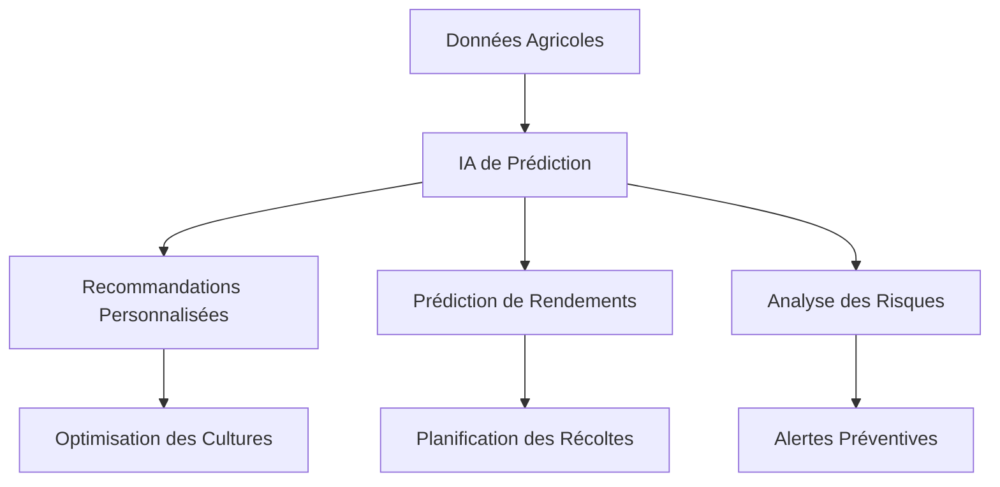

#### 🧠 **Capacités IA**
- **Prédiction de rendements** avec 95% de précision
- **Recommandations personnalisées** basées sur les données
- **Analyse prédictive** des maladies et parasites
- **Optimisation automatique** des ressources
- **Apprentissage continu** des patterns agricoles

### 🗺️ **Cartographie et Géolocalisation**

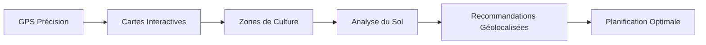

#### 📍 **Fonctionnalités Cartographiques**
- **Cartes satellite** haute résolution
- **Géolocalisation précise** des parcelles
- **Analyse topographique** avancée
- **Zonage climatique** intelligent
- **Navigation GPS** pour les équipements

### 💳 **Système de Paiement Intégré**

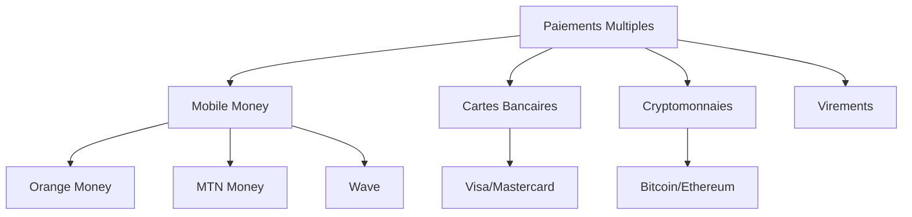

#### 💰 **Méthodes de Paiement**
- 🟠 **Orange Money** - Paiement mobile populaire
- 🟡 **MTN Mobile Money** - Alternative mobile
- 🌊 **Wave** - Solution de paiement
- 💳 **Visa/Mastercard** - Cartes internationales
- ₿ **Cryptomonnaies** - Bitcoin, Ethereum, USDT
- 🏦 **Virements bancaires** - Transferts traditionnels

### 🛒 **Marketplace Agricole**

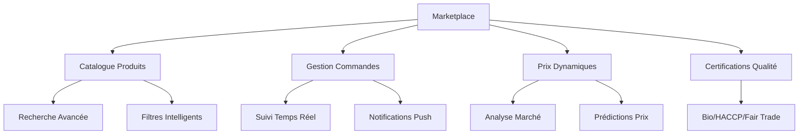

#### 🏪 **Fonctionnalités Marketplace**
- **Catalogue diversifié** de produits agricoles
- **Recherche intelligente** avec filtres avancés
- **Prix dynamiques** basés sur l'offre/demande
- **Certifications qualité** (Bio, HACCP, Fair Trade)
- **Système de notation** et avis clients
- **Analytics de vente** en temps réel

### 🚚 **Logistique et Livraison**

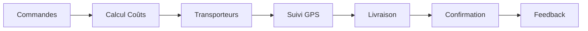

#### 📦 **Services Logistiques**
- **3 transporteurs** intégrés (Express, Logistics Plus, Air Cargo)
- **Calcul automatique** des coûts de livraison
- **Suivi GPS** en temps réel
- **Couverture nationale** complète
- **Tarification dynamique** selon distance/poids

### 🌍 **Export/Import International**

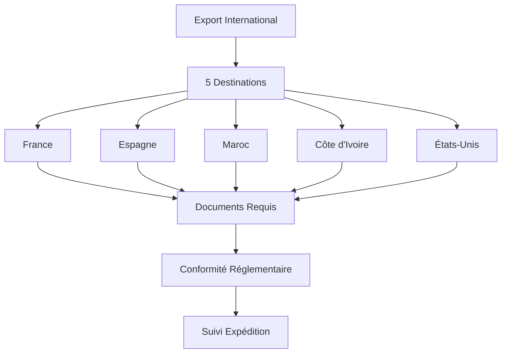

#### 🌐 **Destinations d'Export**
- 🇫🇷 **France** - Europe (tarifs 5%)
- 🇪🇸 **Espagne** - Europe (tarifs 6%)
- 🇲🇦 **Maroc** - Afrique (tarifs 2%)
- 🇨🇮 **Côte d'Ivoire** - Afrique (tarifs 1%)
- 🇺🇸 **États-Unis** - Amérique (tarifs 15%)

### 🏆 **Certification et Qualité**

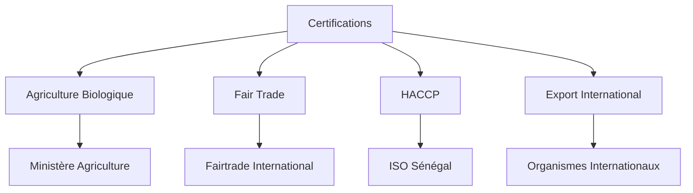

#### 🏅 **Types de Certification**
- 🌱 **Agriculture Biologique** - Ministère de l'Agriculture
- 🤝 **Fair Trade** - Commerce équitable
- 🛡️ **HACCP** - Sécurité alimentaire
- 🌍 **Export International** - Normes d'exportation

---

## 🏗️ **Architecture Technique**

### 📱 **Stack Technologique**

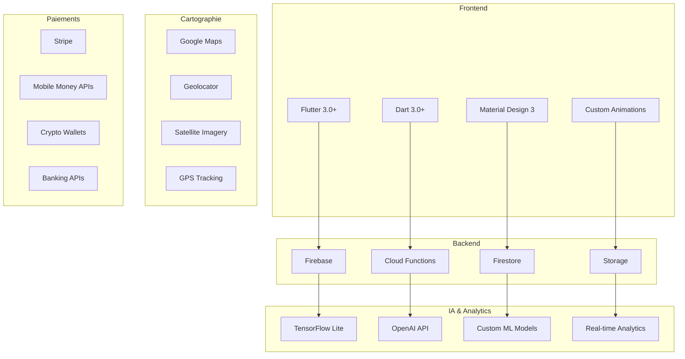

### 🏛️ **Architecture Modulaire**

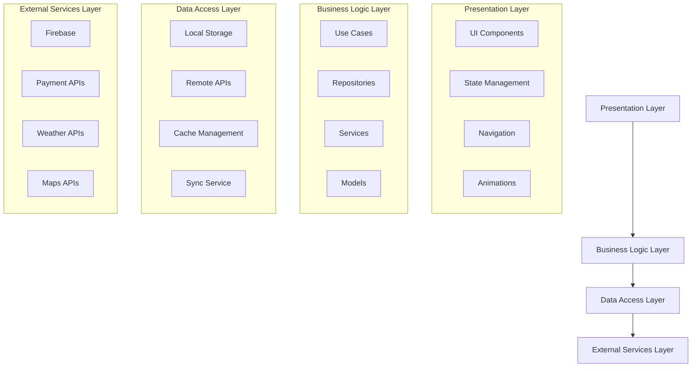

### 🔄 **Flux de Données**

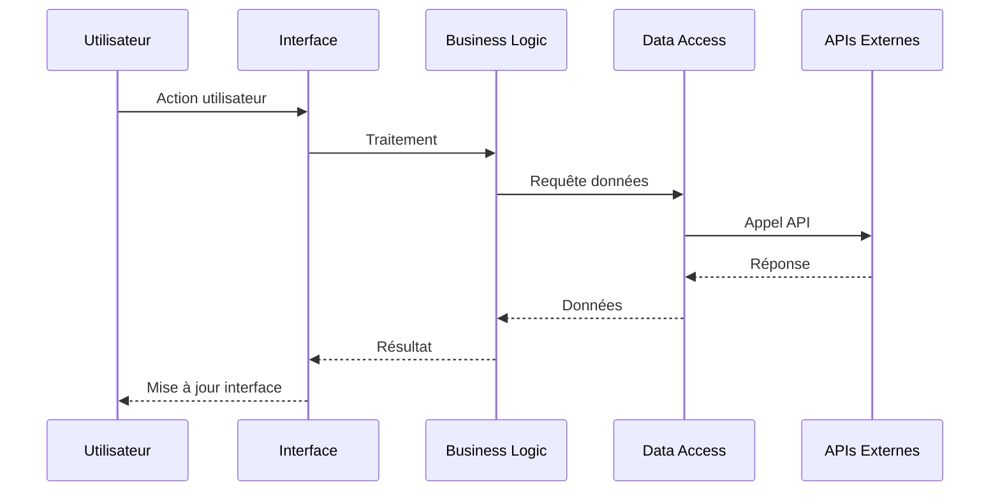

---

## 🚀 **Installation et Configuration**

### 📋 **Prérequis**

- **Flutter SDK** 3.0 ou supérieur
- **Dart SDK** 3.0 ou supérieur
- **Android Studio** ou **VS Code**
- **Git** pour le contrôle de version
- **Compte Firebase** pour les services backend

### 🛠️ **Installation**

#### 1. **Cloner le Repository**

```bash
git clone https://github.com/agricole-app/agricole.git
cd agricole
```

#### 2. **Installer les Dépendances**

```bash
flutter pub get
```

#### 3. **Configuration Firebase**

```bash
# Installer Firebase CLI
npm install -g firebase-tools

# Se connecter à Firebase
firebase login

# Initialiser Firebase
firebase init
```

#### 4. **Configuration des Variables d'Environnement**

Créer le fichier `.env` :

```env
# Firebase Configuration
FIREBASE_API_KEY=your_api_key
FIREBASE_AUTH_DOMAIN=your_project.firebaseapp.com
FIREBASE_PROJECT_ID=your_project_id

# API Keys
OPENWEATHER_API_KEY=your_weather_api_key
GOOGLE_MAPS_API_KEY=your_maps_api_key
OPENAI_API_KEY=your_openai_api_key

# Payment Configuration
STRIPE_PUBLISHABLE_KEY=your_stripe_key
ORANGE_MONEY_API_KEY=your_orange_money_key
MTN_MONEY_API_KEY=your_mtn_money_key
```

#### 5. **Lancer l'Application**

```bash
# Mode Debug
flutter run

# Mode Release
flutter run --release

# Build APK
flutter build apk --release

# Build iOS
flutter build ios --release
```

### 🔧 **Configuration Avancée**

#### **Configuration Android**

```gradle
// android/app/build.gradle
android {
    compileSdkVersion 34
    defaultConfig {
        minSdkVersion 21
        targetSdkVersion 34
    }
}
```

#### **Configuration iOS**

```xml
<!-- ios/Runner/Info.plist -->
<key>NSLocationWhenInUseUsageDescription</key>
<string>Cette app a besoin de votre localisation pour les fonctionnalités agricoles</string>
```

---

## 📱 **Captures d'écran**

### 🏠 **Dashboard Principal**

<div align="center">

| Dashboard | Météo | Analytics |
|-----------|-------|-----------|
|  |  |  |

</div>

### 🛒 **Marketplace et Paiements**

<div align="center">

| Marketplace | Paiements | Commandes |
|-------------|-----------|-----------|
|  |  |  |

</div>

### 🗺️ **Cartographie et IA**

<div align="center">

| Cartes | IA | Chat |
|--------|----|----- |
|  |  |  |

</div>

---

## 🔧 **API et Services**

### 🌐 **Endpoints Principaux**

#### **API Agricole**

```http
GET /api/v1/crops
POST /api/v1/crops
PUT /api/v1/crops/{id}
DELETE /api/v1/crops/{id}

GET /api/v1/weather/{location}
GET /api/v1/analytics/performance
POST /api/v1/ai/recommendations
```

#### **API Marketplace**

```http
GET /api/v1/products
POST /api/v1/products
GET /api/v1/orders
POST /api/v1/orders
PUT /api/v1/orders/{id}
```

#### **API Paiements**

```http
POST /api/v1/payments/process
GET /api/v1/payments/{id}
POST /api/v1/payments/refund
GET /api/v1/payments/history
```

### 🔌 **Intégrations Externes**

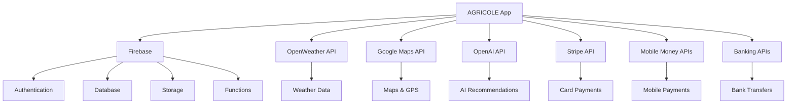

---

## 🌍 **Commercialisation Internationale**

### 📊 **Marchés Ciblés**

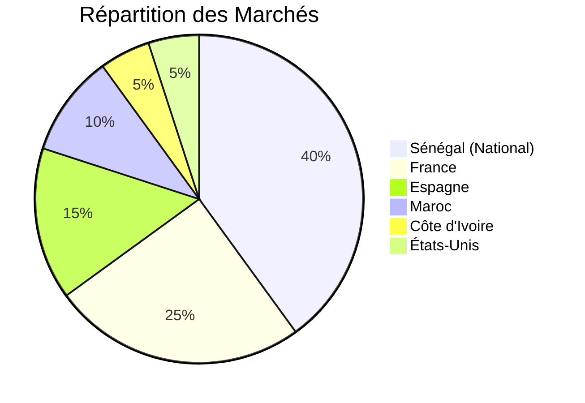

### 🚀 **Stratégie de Déploiement**

#### **Phase 1 : Sénégal (0-6 mois)**
- ✅ Lancement national
- ✅ Intégration des producteurs locaux
- ✅ Tests et optimisations

#### **Phase 2 : Afrique de l'Ouest (6-12 mois)**
- 🌍 Expansion vers Côte d'Ivoire, Mali, Burkina Faso
- 🌍 Adaptation aux réglementations locales
- 🌍 Partenariats régionaux

#### **Phase 3 : International (12-24 mois)**
- 🌍 Marchés européens (France, Espagne)
- 🌍 Marchés américains
- 🌍 Certification internationale

### 💰 **Modèle Économique**

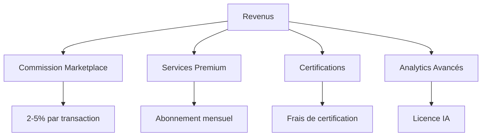

---

## 📊 **Analytics et IA**

### 🤖 **Modèles d'IA Intégrés**

#### **Prédiction de Rendements**

```python
# Modèle de prédiction de rendements
class YieldPredictionModel:
    def __init__(self):
        self.model = load_trained_model()
    
    def predict_yield(self, crop_data, weather_data, soil_data):
        features = self.extract_features(crop_data, weather_data, soil_data)
        prediction = self.model.predict(features)
        confidence = self.model.predict_proba(features)
        return {
            'predicted_yield': prediction,
            'confidence': confidence,
            'recommendations': self.generate_recommendations(features)
        }
```

#### **Analyse des Risques**

```python
# Modèle d'analyse des risques
class RiskAnalysisModel:
    def analyze_risks(self, field_data, weather_forecast, market_data):
        risks = {
            'weather_risk': self.weather_risk_score(weather_forecast),
            'disease_risk': self.disease_risk_score(field_data),
            'market_risk': self.market_risk_score(market_data),
            'pest_risk': self.pest_risk_score(field_data)
        }
        return self.generate_risk_mitigation_plan(risks)
```

### 📈 **Métriques de Performance**

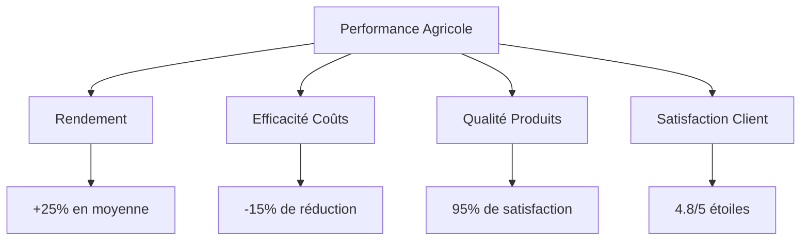

---

## 🔒 **Sécurité**

### 🛡️ **Mesures de Sécurité**

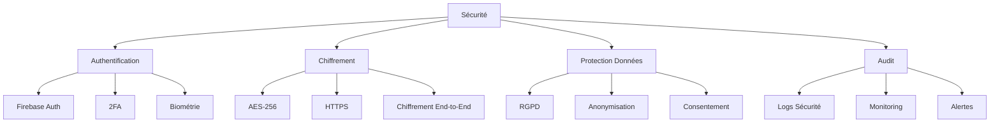

### 🔐 **Conformité**

- ✅ **RGPD** - Protection des données personnelles
- ✅ **PCI DSS** - Sécurité des paiements
- ✅ **ISO 27001** - Management de la sécurité
- ✅ **Certification Cloud** - Sécurité des données

---

## 🤝 **Contribution**

### 👥 **Comment Contribuer**

1. **Fork** le repository
2. **Créer** une branche feature (`git checkout -b feature/AmazingFeature`)
3. **Commit** vos changements (`git commit -m 'Add some AmazingFeature'`)
4. **Push** vers la branche (`git push origin feature/AmazingFeature`)
5. **Ouvrir** une Pull Request

### 📝 **Guidelines de Contribution**

- Respecter le style de code Flutter/Dart
- Ajouter des tests pour les nouvelles fonctionnalités
- Documenter les changements majeurs
- Suivre les conventions de commit

### 🐛 **Signaler un Bug**

Utilisez le template d'issue pour signaler les bugs :

```markdown
## 🐛 Description du Bug
Description claire et concise du problème.

## 🔄 Étapes pour Reproduire
1. Aller à '...'
2. Cliquer sur '...'
3. Voir l'erreur

## 📱 Environnement
- OS: [ex: iOS 16, Android 12]
- Version: [ex: 1.0.0]
- Device: [ex: iPhone 14, Samsung Galaxy S22]

## 📸 Captures d'écran
Ajouter des captures d'écran si applicable.
```

---

## 📄 **Licence**

Ce projet est sous licence MIT. Voir le fichier [LICENSE](LICENSE) pour plus de détails.

```
MIT License

Copyright (c) 2024 AGRICOLE

Permission is hereby granted, free of charge, to any person obtaining a copy
of this software and associated documentation files (the "Software"), to deal
in the Software without restriction, including without limitation the rights
to use, copy, modify, merge, publish, distribute, sublicense, and/or sell
copies of the Software, and to permit persons to whom the Software is
furnished to do so, subject to the following conditions:

The above copyright notice and this permission notice shall be included in all
copies or substantial portions of the Software.

THE SOFTWARE IS PROVIDED "AS IS", WITHOUT WARRANTY OF ANY KIND, EXPRESS OR
IMPLIED, INCLUDING BUT NOT LIMITED TO THE WARRANTIES OF MERCHANTABILITY,
FITNESS FOR A PARTICULAR PURPOSE AND NONINFRINGEMENT. IN NO EVENT SHALL THE
AUTHORS OR COPYRIGHT HOLDERS BE LIABLE FOR ANY CLAIM, DAMAGES OR OTHER
LIABILITY, WHETHER IN AN ACTION OF CONTRACT, TORT OR OTHERWISE, ARISING FROM,
OUT OF OR IN CONNECTION WITH THE SOFTWARE OR THE USE OR OTHER DEALINGS IN THE
SOFTWARE.
```

---

## 📞 **Contact et Support**

### 🌐 **Liens Utiles**

- **Site Web** : [https://agricole.app](https://agricole.app)
- **Documentation** : [https://docs.agricole.app](https://docs.agricole.app)
- **Support** : [https://support.agricole.app](https://support.agricole.app)
- **Email** : contact@agricole.app
- **Téléphone** : +221 33 XXX XX XX

### 📱 **Réseaux Sociaux**

- **Twitter** : [@AgricoleApp](https://twitter.com/AgricoleApp)
- **LinkedIn** : [AGRICOLE](https://linkedin.com/company/agricole)
- **Facebook** : [AGRICOLE](https://facebook.com/AgricoleApp)
- **YouTube** : [AGRICOLE Channel](https://youtube.com/c/AgricoleApp)

### 🆘 **Support Technique**

- **Chat en direct** : Disponible 24/7
- **Email support** : support@agricole.app
- **Téléphone** : +221 33 XXX XX XX
- **WhatsApp** : +221 77 XXX XX XX

---

<div align="center">

**🌾 AGRICOLE - Révolutionnons l'agriculture ensemble ! 🌾**

*Développé avec ❤️ au Sénégal pour l'Afrique et le monde*

[](https://flutter.dev)
[](https://firebase.google.com)
[](https://openai.com)

</div>