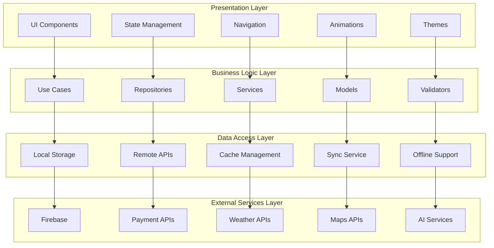
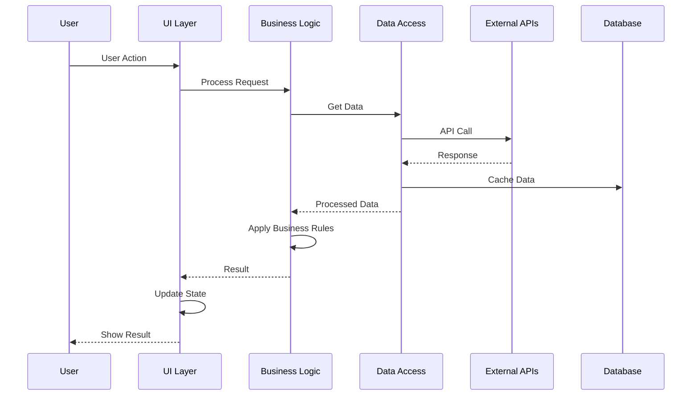
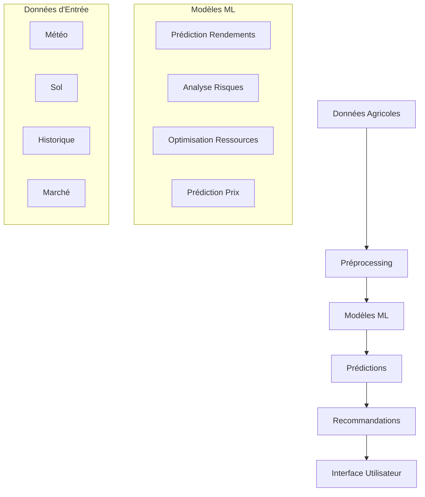
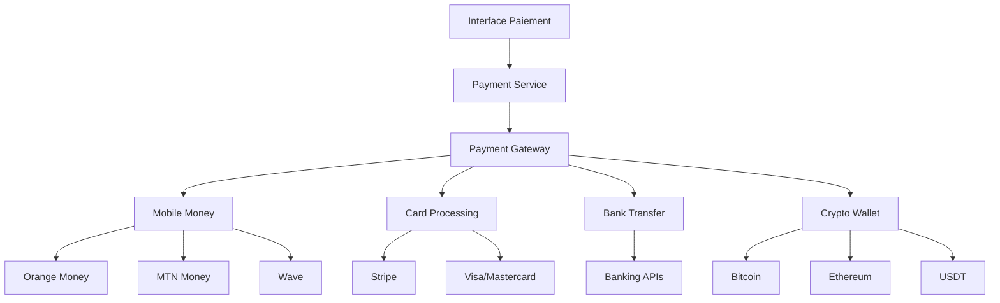
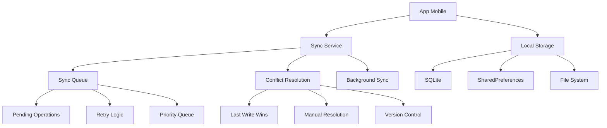

# 🔧 **Documentation Technique AGRICOLE**

## 📋 **Architecture Détaillée**

### 🏗️ **Architecture en Couches**



### 🔄 **Flux de Données Détaillé**



## 🎨 **Système d'Animations Avancé**

### ✨ **Types d'Animations Implémentées**

#### 1. **Animations de Particules**

```dart
// Service d'animations de particules flottantes
class ParticleAnimationService {
  static Widget createFloatingParticles({
    required Widget child,
    int particleCount = 20,
    Color particleColor = Colors.white,
    double opacity = 0.6,
  }) {
    return Stack(
      children: [
        child,
        ...List.generate(particleCount, (index) {
          return _FloatingParticle(
            color: particleColor,
            opacity: opacity,
            delay: Duration(milliseconds: index * 100),
          );
        }),
      ],
    );
  }
}
```

#### 2. **Effets de Verre (Glassmorphism)**

```dart
// Effet de verre avec flou et transparence
class GlassEffectService {
  static Widget createGlassEffect({
    required Widget child,
    double opacity = 0.2,
    double blur = 10.0,
    Color tintColor = Colors.white,
  }) {
    return ClipRRect(
      borderRadius: BorderRadius.circular(20),
      child: BackdropFilter(
        filter: ui.ImageFilter.blur(sigmaX: blur, sigmaY: blur),
        child: Container(
          decoration: BoxDecoration(
            color: tintColor.withOpacity(opacity),
            borderRadius: BorderRadius.circular(20),
            border: Border.all(
              color: Colors.white.withOpacity(0.2),
              width: 1.5,
            ),
          ),
          child: child,
        ),
      ),
    );
  }
}
```

#### 3. **Animations de Morphing**

```dart
// Animation de transformation de formes
class MorphingAnimationService {
  static Widget createMorphingShape({
    required Widget child,
    Duration duration = const Duration(seconds: 2),
  }) {
    return AnimatedBuilder(
      animation: AlwaysStoppedAnimation(0.0),
      builder: (context, _) {
        return TweenAnimationBuilder<double>(
          duration: duration,
          tween: Tween(begin: 0.0, end: 1.0),
          builder: (context, value, _) {
            return Transform(
              transform: Matrix4.identity()
                ..setEntry(3, 2, 0.001)
                ..rotateY(value * math.pi * 2),
              child: child,
            );
          },
        );
      },
    );
  }
}
```

### 🎭 **Système de Thèmes Dynamiques**

```dart
class DynamicThemeService {
  static ThemeData createTheme({
    required Color primaryColor,
    required Color accentColor,
    required bool isDarkMode,
    required double fontSize,
  }) {
    return ThemeData(
      brightness: isDarkMode ? Brightness.dark : Brightness.light,
      primarySwatch: _createMaterialColor(primaryColor),
      primaryColor: primaryColor,
      accentColor: accentColor,
      fontFamily: 'Roboto',
      textTheme: TextTheme(
        headline1: TextStyle(fontSize: fontSize * 2.0),
        headline2: TextStyle(fontSize: fontSize * 1.8),
        headline3: TextStyle(fontSize: fontSize * 1.6),
        bodyText1: TextStyle(fontSize: fontSize),
        bodyText2: TextStyle(fontSize: fontSize * 0.9),
      ),
      cardTheme: CardTheme(
        elevation: 8,
        shape: RoundedRectangleBorder(
          borderRadius: BorderRadius.circular(16),
        ),
      ),
    );
  }
}
```

## 🤖 **Intelligence Artificielle Intégrée**

### 🧠 **Architecture IA**



### 🔮 **Modèles de Prédiction**

#### **Prédiction de Rendements**

```python
# Modèle de prédiction de rendements avec TensorFlow
import tensorflow as tf
import numpy as np

class YieldPredictionModel:
    def __init__(self):
        self.model = self.build_model()
        self.scaler = StandardScaler()
    
    def build_model(self):
        model = tf.keras.Sequential([
            tf.keras.layers.Dense(128, activation='relu', input_shape=(10,)),
            tf.keras.layers.Dropout(0.3),
            tf.keras.layers.Dense(64, activation='relu'),
            tf.keras.layers.Dropout(0.3),
            tf.keras.layers.Dense(32, activation='relu'),
            tf.keras.layers.Dense(1, activation='linear')
        ])
        
        model.compile(
            optimizer='adam',
            loss='mse',
            metrics=['mae', 'mape']
        )
        return model
    
    def predict_yield(self, features):
        # Normaliser les features
        normalized_features = self.scaler.transform(features)
        
        # Prédiction
        prediction = self.model.predict(normalized_features)
        
        # Calculer la confiance
        confidence = self.calculate_confidence(features)
        
        return {
            'predicted_yield': prediction[0][0],
            'confidence': confidence,
            'recommendations': self.generate_recommendations(features)
        }
```

#### **Analyse des Risques**

```python
# Modèle d'analyse des risques agricoles
class RiskAnalysisModel:
    def __init__(self):
        self.weather_model = self.load_weather_model()
        self.disease_model = self.load_disease_model()
        self.pest_model = self.load_pest_model()
    
    def analyze_risks(self, field_data, weather_forecast, market_data):
        risks = {
            'weather_risk': self.weather_model.predict(weather_forecast),
            'disease_risk': self.disease_model.predict(field_data),
            'pest_risk': self.pest_model.predict(field_data),
            'market_risk': self.analyze_market_risk(market_data)
        }
        
        # Calculer le score de risque global
        overall_risk = self.calculate_overall_risk(risks)
        
        return {
            'risks': risks,
            'overall_risk': overall_risk,
            'mitigation_plan': self.generate_mitigation_plan(risks)
        }
```

## 💳 **Système de Paiement Avancé**

### 🏦 **Architecture de Paiement**



### 💰 **Implémentation des Paiements**

```dart
class PaymentService {
  // Traitement des paiements multi-méthodes
  static Future<PaymentResult> processPayment({
    required PaymentRequest request,
    required PaymentMethod method,
  }) async {
    try {
      switch (method.type) {
        case 'mobile_money':
          return await _processMobileMoneyPayment(request, method);
        case 'card':
          return await _processCardPayment(request, method);
        case 'bank_transfer':
          return await _processBankTransfer(request, method);
        case 'crypto':
          return await _processCryptoPayment(request, method);
        default:
          throw UnsupportedPaymentMethodException();
      }
    } catch (e) {
      return PaymentResult(
        success: false,
        error: e.toString(),
        transactionId: null,
      );
    }
  }
  
  // Calcul des frais de transaction
  static double calculateFees({
    required double amount,
    required PaymentMethod method,
    required String currency,
  }) {
    double feePercentage = _getFeePercentage(method.type);
    double baseFee = amount * feePercentage;
    
    // Frais minimum
    double minFee = _getMinimumFee(method.type, currency);
    
    return math.max(baseFee, minFee);
  }
}
```

## 🗺️ **Système de Cartographie**

### 📍 **Intégration Cartographique**

```dart
class MappingService {
  // Initialisation des cartes
  static Future<void> initializeMaps() async {
    await GoogleMapsFlutter.initialize();
    await Geolocator.requestPermission();
  }
  
  // Géolocalisation précise
  static Future<Position> getCurrentLocation() async {
    bool serviceEnabled = await Geolocator.isLocationServiceEnabled();
    if (!serviceEnabled) {
      throw LocationServiceDisabledException();
    }
    
    LocationPermission permission = await Geolocator.checkPermission();
    if (permission == LocationPermission.denied) {
      permission = await Geolocator.requestPermission();
      if (permission == LocationPermission.denied) {
        throw LocationPermissionDeniedException();
      }
    }
    
    return await Geolocator.getCurrentPosition(
      desiredAccuracy: LocationAccuracy.high,
    );
  }
  
  // Calcul de zones de culture
  static List<Polygon> calculateCultivationZones({
    required LatLng center,
    required double radius,
    required SoilType soilType,
  }) {
    List<LatLng> points = _generateCirclePoints(center, radius);
    return _createPolygonsFromPoints(points, soilType);
  }
}
```

## 📊 **Analytics et Métriques**

### 📈 **Système d'Analytics**

```dart
class AnalyticsService {
  // Suivi des événements
  static void trackEvent({
    required String eventName,
    required Map<String, dynamic> parameters,
    String userId = 'anonymous',
  }) {
    FirebaseAnalytics.instance.logEvent(
      name: eventName,
      parameters: parameters,
    );
    
    // Sauvegarde locale pour synchronisation hors ligne
    _saveEventLocally(eventName, parameters, userId);
  }
  
  // Métriques de performance agricole
  static Future<PerformanceMetrics> calculatePerformanceMetrics({
    required String userId,
    required DateTime startDate,
    required DateTime endDate,
  }) async {
    List<CropData> crops = await _getCropData(userId, startDate, endDate);
    
    return PerformanceMetrics(
      yieldEfficiency: _calculateYieldEfficiency(crops),
      costEfficiency: _calculateCostEfficiency(crops),
      profitMargin: _calculateProfitMargin(crops),
      waterUsage: _calculateWaterUsage(crops),
      fertilizerEfficiency: _calculateFertilizerEfficiency(crops),
    );
  }
}
```

## 🔄 **Synchronisation Hors Ligne**

### 📱 **Architecture Offline-First**



### 🔄 **Implémentation de la Sync**

```dart
class SyncService {
  static Timer? _syncTimer;
  static bool _isOnline = true;
  
  // Démarrer la synchronisation automatique
  static void startAutoSync({Duration interval = const Duration(minutes: 5)}) {
    _syncTimer?.cancel();
    _syncTimer = Timer.periodic(interval, (timer) async {
      if (await checkConnectivity()) {
        await syncPendingData();
      }
    });
  }
  
  // Synchroniser les données en attente
  static Future<void> syncPendingData() async {
    List<SyncOperation> pendingOps = await _getPendingOperations();
    
    for (SyncOperation op in pendingOps) {
      try {
        await _executeOperation(op);
        await _markOperationCompleted(op.id);
      } catch (e) {
        await _handleSyncError(op, e);
      }
    }
  }
  
  // Résolution des conflits
  static Future<ConflictResolution> resolveConflict({
    required ConflictData conflict,
  }) async {
    // Stratégie de résolution basée sur le type de conflit
    switch (conflict.type) {
      case ConflictType.dataConflict:
        return _resolveDataConflict(conflict);
      case ConflictType.versionConflict:
        return _resolveVersionConflict(conflict);
      case ConflictType.permissionConflict:
        return _resolvePermissionConflict(conflict);
      default:
        return ConflictResolution.manual;
    }
  }
}
```

## 🔒 **Sécurité et Conformité**

### 🛡️ **Mesures de Sécurité**

```dart
class SecurityService {
  // Chiffrement des données sensibles
  static Future<String> encryptSensitiveData(String data) async {
    final key = await _getEncryptionKey();
    final iv = _generateIV();
    
    final encrypter = Encrypter(AES(key));
    final encrypted = encrypter.encrypt(data, iv: iv);
    
    return encrypted.base64;
  }
  
  // Validation des entrées utilisateur
  static bool validateUserInput(String input, InputType type) {
    switch (type) {
      case InputType.email:
        return RegExp(r'^[\w-\.]+@([\w-]+\.)+[\w-]{2,4}$').hasMatch(input);
      case InputType.phone:
        return RegExp(r'^\+?[1-9]\d{1,14}$').hasMatch(input);
      case InputType.password:
        return input.length >= 8 && _hasRequiredCharacters(input);
      default:
        return true;
    }
  }
  
  // Audit des actions utilisateur
  static Future<void> auditUserAction({
    required String userId,
    required String action,
    required Map<String, dynamic> metadata,
  }) async {
    final auditLog = AuditLog(
      userId: userId,
      action: action,
      timestamp: DateTime.now(),
      metadata: metadata,
      ipAddress: await _getUserIPAddress(),
      userAgent: await _getUserAgent(),
    );
    
    await _saveAuditLog(auditLog);
  }
}
```

## 🧪 **Tests et Qualité**

### 🔬 **Stratégie de Tests**

```dart
// Tests unitaires
class CropServiceTest {
  late CropService cropService;
  
  setUp(() {
    cropService = CropService();
  });
  
  group('CropService Tests', () {
    test('should create crop successfully', () async {
      // Arrange
      final cropData = CropData(
        name: 'Riz',
        variety: 'NERICA',
        plantingDate: DateTime.now(),
      );
      
      // Act
      final result = await cropService.createCrop(cropData);
      
      // Assert
      expect(result.isSuccess, true);
      expect(result.data?.name, 'Riz');
    });
    
    test('should validate crop data', () {
      // Arrange
      final invalidCropData = CropData(name: '', variety: '');
      
      // Act
      final validation = cropService.validateCropData(invalidCropData);
      
      // Assert
      expect(validation.isValid, false);
      expect(validation.errors, contains('Name is required'));
    });
  });
}

// Tests d'intégration
class PaymentIntegrationTest {
  testWidgets('should process payment successfully', (WidgetTester tester) async {
    // Arrange
    await tester.pumpWidget(MyApp());
    
    // Act
    await tester.tap(find.byKey(Key('pay_button')));
    await tester.pumpAndSettle();
    
    // Assert
    expect(find.text('Payment Successful'), findsOneWidget);
  });
}
```

## 📱 **Performance et Optimisation**

### ⚡ **Optimisations Implémentées**

```dart
class PerformanceOptimizer {
  // Lazy loading des images
  static Widget buildOptimizedImage(String imageUrl) {
    return CachedNetworkImage(
      imageUrl: imageUrl,
      placeholder: (context, url) => CircularProgressIndicator(),
      errorWidget: (context, url, error) => Icon(Icons.error),
      memCacheWidth: 300,
      memCacheHeight: 300,
    );
  }
  
  // Pagination des listes
  static Widget buildPaginatedList<T>({
    required List<T> items,
    required Widget Function(T) itemBuilder,
    int pageSize = 20,
  }) {
    return ListView.builder(
      itemCount: items.length,
      itemBuilder: (context, index) {
        if (index < items.length) {
          return itemBuilder(items[index]);
        } else {
          return _buildLoadingIndicator();
        }
      },
    );
  }
  
  // Mise en cache des données
  static Future<T> getCachedData<T>({
    required String key,
    required Future<T> Function() fetcher,
    Duration cacheDuration = const Duration(hours: 1),
  }) async {
    final cachedData = await _getFromCache<T>(key);
    if (cachedData != null) {
      return cachedData;
    }
    
    final freshData = await fetcher();
    await _saveToCache(key, freshData, cacheDuration);
    return freshData;
  }
}
```

## 🚀 **Déploiement et CI/CD**

### 🔄 **Pipeline de Déploiement**

```yaml
# .github/workflows/deploy.yml
name: Deploy AGRICOLE

on:
  push:
    branches: [main]
  pull_request:
    branches: [main]

jobs:
  test:
    runs-on: ubuntu-latest
    steps:
      - uses: actions/checkout@v3
      - uses: subosito/flutter-action@v2
        with:
          flutter-version: '3.0.0'
      - run: flutter pub get
      - run: flutter test
      - run: flutter analyze

  build-android:
    needs: test
    runs-on: ubuntu-latest
    steps:
      - uses: actions/checkout@v3
      - uses: subosito/flutter-action@v2
      - run: flutter build apk --release
      - uses: actions/upload-artifact@v3
        with:
          name: app-release.apk
          path: build/app/outputs/flutter-apk/app-release.apk

  build-ios:
    needs: test
    runs-on: macos-latest
    steps:
      - uses: actions/checkout@v3
      - uses: subosito/flutter-action@v2
      - run: flutter build ios --release
      - uses: actions/upload-artifact@v3
        with:
          name: app-release.ipa
          path: build/ios/ipa/app-release.ipa
```

---

## 📚 **Ressources et Documentation**

### 📖 **Documentation Technique**

- **Architecture** : [docs/architecture.md](docs/architecture.md)
- **API Reference** : [docs/api.md](docs/api.md)
- **Deployment** : [docs/deployment.md](docs/deployment.md)
- **Security** : [docs/security.md](docs/security.md)

### 🔗 **Liens Utiles**

- **Flutter Documentation** : [https://flutter.dev/docs](https://flutter.dev/docs)
- **Firebase Documentation** : [https://firebase.google.com/docs](https://firebase.google.com/docs)
- **Google Maps API** : [https://developers.google.com/maps](https://developers.google.com/maps)

---

<div align="center">

**🔧 Documentation Technique AGRICOLE - Version 1.0.0**

*Dernière mise à jour : Décembre 2024*

</div>
